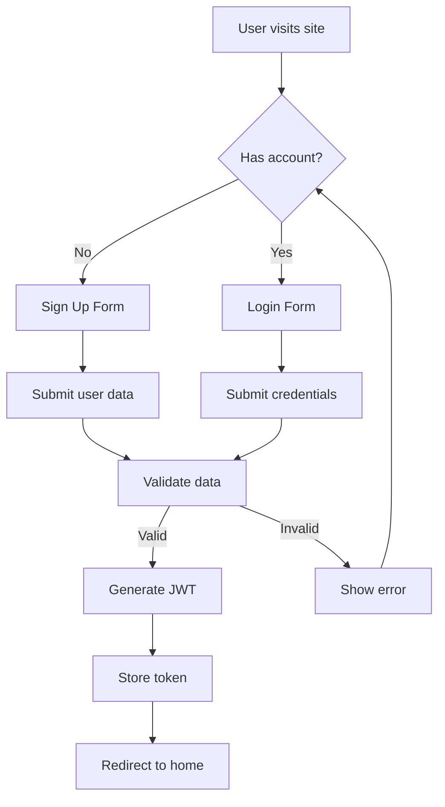
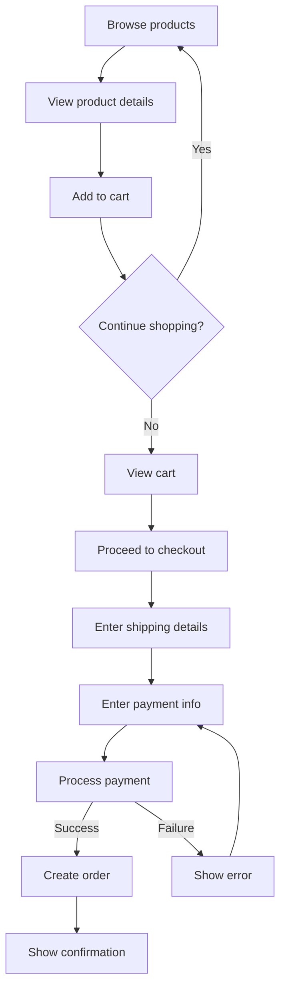
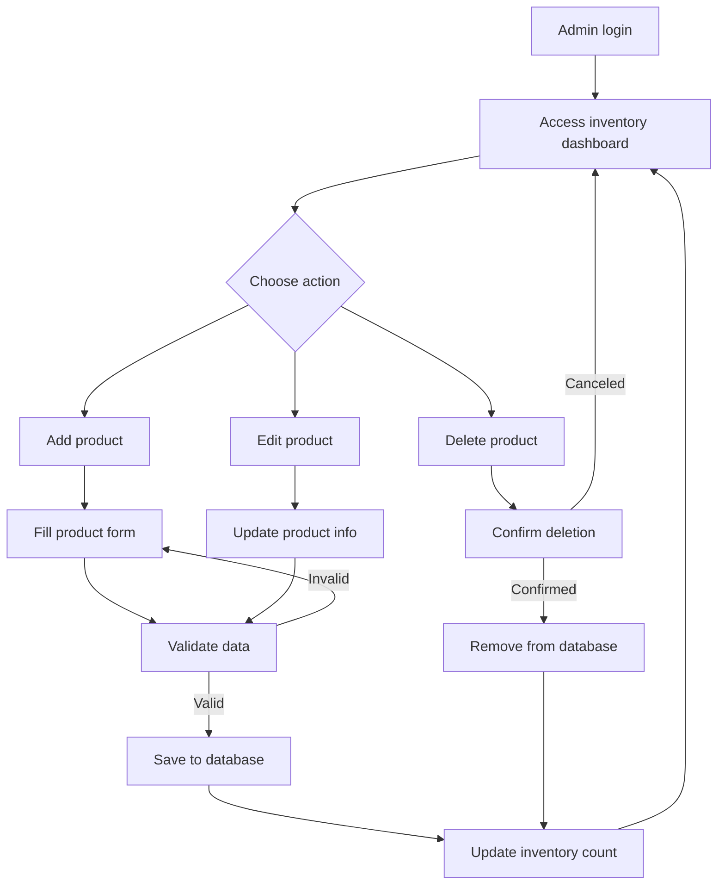
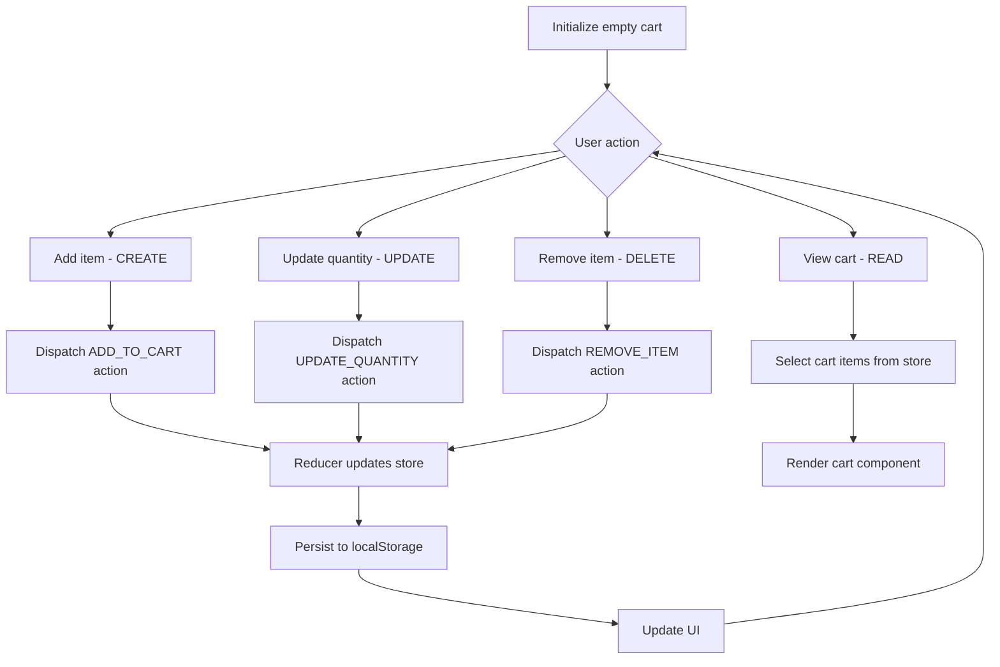

# Fashion E-Commerce Single Page Application

A modern, responsive single-page application for fashion e-commerce with a seamless shopping experience.

## Table of Contents
- [Technologies Used](#technologies-used)
- [Features](#features)
- [Application Architecture](#application-architecture)
- [Flowcharts](#flowcharts)
- [Setup and Installation](#setup-and-installation)
- [Contributing](#contributing)

## Technologies Used

### Frontend
- **React.js** - UI component library
- **Redux** - State management
- **Redux Toolkit** - Simplified Redux development
- **React Router** - Navigation management
- **Styled Components** - CSS-in-JS styling

### Backend
- **Firebase** - Cloud database and backend services
- **Firebase Authentication** - User management and authentication
- **Firebase Firestore** - NoSQL document database
- **Firebase Storage** - File storage for product images
- **Firebase Cloud Functions** - Serverless backend logic

### DevOps & Tools
- **Git/GitHub** - Version control
- **Webpack** - Module bundler
- **ESLint/Prettier** - Code quality

## Features
- User authentication
- Product browsing and filtering
- Shopping cart management
- Checkout process
- Order history
- Admin dashboard for inventory management

## Application Architecture

```
┌─────────────────────────────────────────────────────┐
│                     CLIENT SIDE                     │
│  ┌─────────────┐  ┌─────────────┐  ┌─────────────┐  │
│  │    React    │  │    Redux    │  │   Router    │  │
│  │  Components │◄─┤    Store    │◄─┤   Routes    │  │
│  └─────────────┘  └─────────────┘  └─────────────┘  │
└───────────────────────────┬─────────────────────────┘
                            │ API Calls
                            ▼
┌─────────────────────────────────────────────────────┐
│                     SERVER SIDE                     │
│  ┌─────────────┐  ┌─────────────┐  ┌─────────────┐  │
│  │  Express.js │  │  Business   │  │    Auth     │  │
│  │   Routes    │◄─┤   Logic     │◄─┤  Middleware │  │
│  └─────────────┘  └─────────────┘  └─────────────┘  │
└───────────────────────────┬─────────────────────────┘
                            │ Database Operations
                            ▼
┌─────────────────────────────────────────────────────┐
│                      DATABASE                       │
│  ┌─────────────┐  ┌─────────────┐  ┌─────────────┐  │
│  │   Users     │  │  Products   │  │   Orders    │  │
│  │ Collection  │  │ Collection  │  │ Collection  │  │
│  └─────────────┘  └─────────────┘  └─────────────┘  │
└─────────────────────────────────────────────────────┘
```

## Flowcharts

### User Authentication Flow



### Buying Process Flow



### Inventory Management Flow



### Redux Cart Logic (CRUD Operations)



